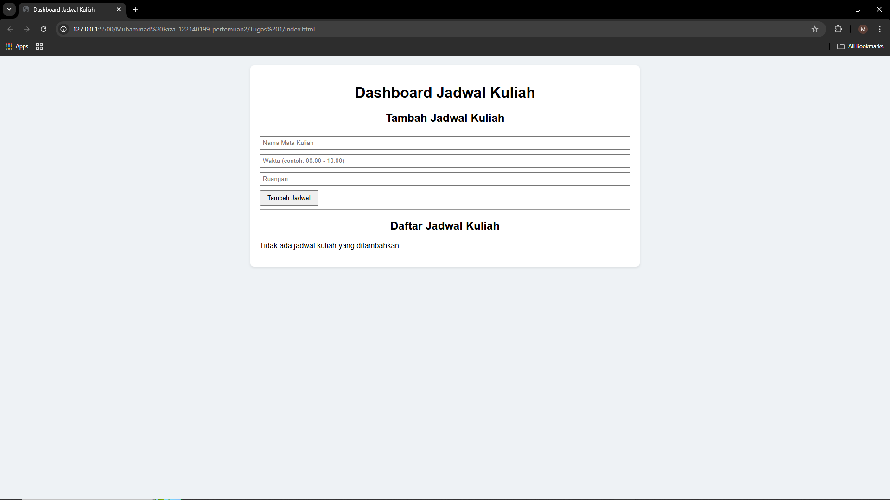

Personal Dashboard - Jadwal Kuliah

Deskripsi Aplikasi

Aplikasi ini adalah Personal Dashboard sederhana yang dirancang untuk membantu mahasiswa dalam mengelola jadwal kuliah mereka. Fitur utama aplikasi meliputi:

Penambahan Jadwal Kuliah: Pengguna dapat menambahkan jadwal kuliah baru dengan mengisi nama mata kuliah, waktu, dan ruangan.

Pengeditan Jadwal: Pengguna dapat mengedit data jadwal yang sudah ditambahkan (misalnya mengubah nama mata kuliah, waktu, atau ruangan) menggunakan prompt sederhana.

Penghapusan Jadwal: Pengguna dapat menghapus jadwal kuliah yang tidak lagi diperlukan.

Penyimpanan Data Lokal: Data disimpan menggunakan localStorage, sehingga meskipun halaman direfresh, jadwal yang sudah dibuat akan tetap ada.

Fitur Interaktif: Setiap aksi (tambah, edit, hapus) langsung diperbarui dan direfleksikan di UI.

Aplikasi ini ditujukan untuk memenuhi kebutuhan spesifik seorang mahasiswa agar dapat melihat dan mengelola jadwal kuliahnya dengan cepat dan praktis.

Screenshot Aplikasi

Fitur ES6+ yang Diimplementasikan

Aplikasi ini dibangun dengan menggunakan fitur-fitur modern dari JavaScript (ES6+), antara lain:

Deklarasi Variabel: const dan let digunakan untuk mendeklarasikan variabel secara tepat.

Arrow Functions: Digunakan pada metode-metode di dalam class, misalnya untuk inisialisasi (init), penambahan jadwal (addSchedule), penghapusan (deleteSchedule), dan rendering data (renderSchedules).

Template Literals: Digunakan untuk merender tampilan HTML secara dinamis, memudahkan penulisan string yang mengandung variabel.

Fungsi Asinkron (Async/Await): Diterapkan di fungsi loadInitialData untuk mensimulasikan delay saat pemuatan data awal.

Classes: Kelas Dashboard digunakan untuk mengorganisasi logika aplikasi secara OOP, memudahkan pemeliharaan dan pengembangan aplikasi.