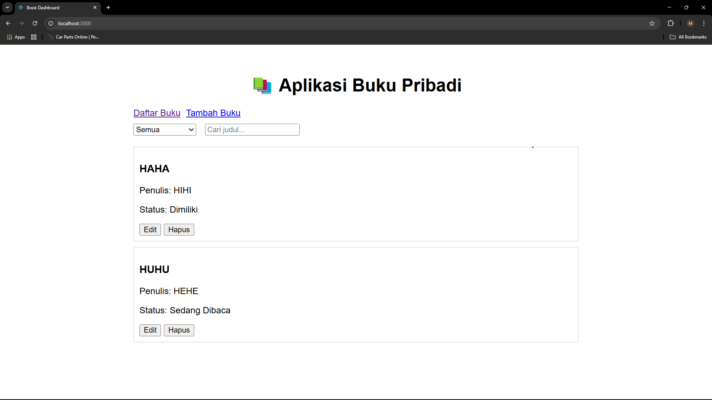
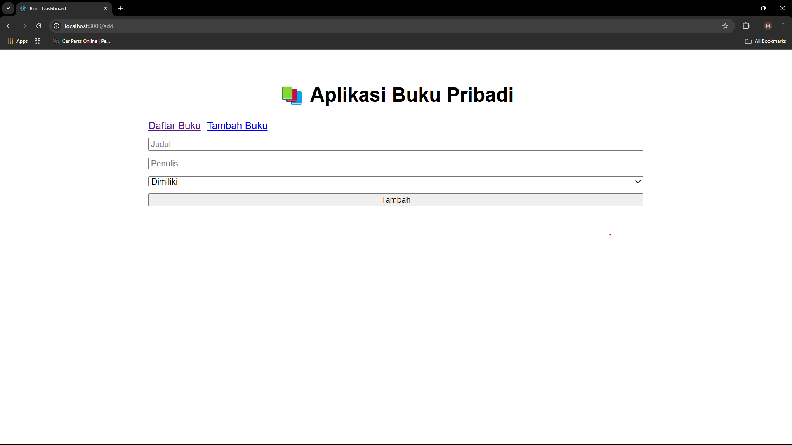
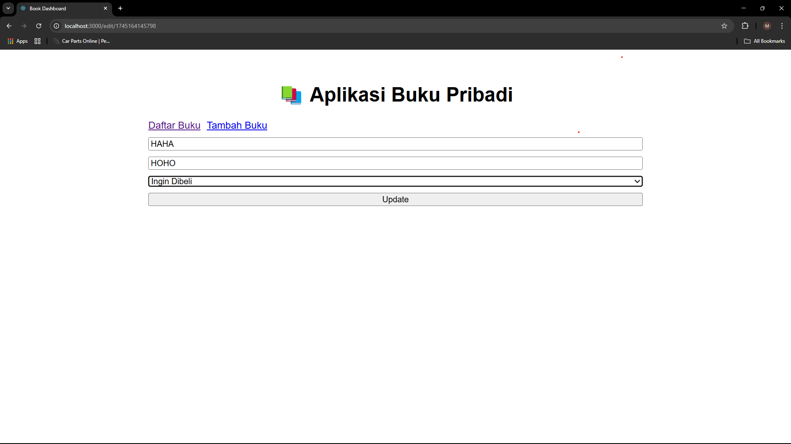
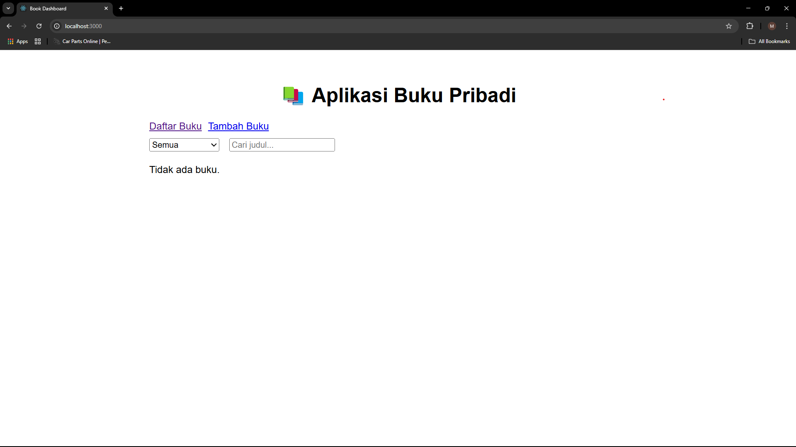
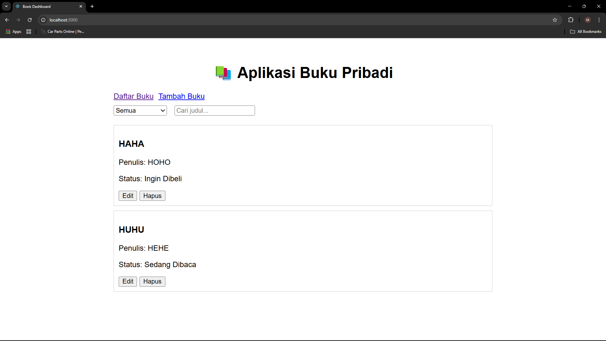
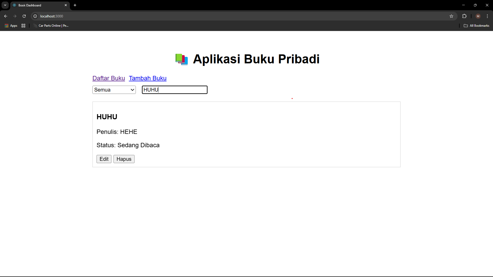

# Aplikasi Manajemen Buku Pribadi

## Deskripsi Aplikasi

Aplikasi ini memungkinkan pengguna untuk:

- **Menambah** buku baru dengan informasi judul, penulis, dan status (Dimiliki, Sedang Dibaca, Ingin Dibeli)
- **Mengedit** data buku yang sudah tersimpan
- **Menghapus** buku dari daftar
- **Memfilter** buku berdasarkan status
- **Mencari** buku berdasarkan judul

State aplikasi dikelola dengan **Context API** dan disimpan di browser menggunakan **localStorage**. Navigasi multi-halaman di-handle oleh **React Router**.

## Instruksi Instalasi dan Menjalankan

1. Clone repository:
   ```bash
   git clone https://github.com/MFZ2840/pemrograman_web_itera_122140199.git
   cd pemrograman_web_itera_122140199
   ```
2. Install dependencies:
   ```bash
   npm install
   ```
3. Jalankan development server:
   ```bash
   npm start
   ```
4. Akses aplikasi di: [http://localhost:3000](http://localhost:3000)

## Screenshot Antarmuka

**Daftar Buku**  


**Tambah Buku**  


**Edit Buku**  


## Fitur React yang Digunakan

- **Functional Components** dengan Hooks (`useState`, `useEffect`)
- **Context API** (pada `src/context/BookContext.jsx`) untuk state global
- **Custom Hooks**:
  - `useLocalStorage` untuk sinkronisasi state dengan localStorage
  - `useBooks` untuk logika CRUD dan filter/search
- **React Router** di `App.jsx` untuk multi-halaman (`/`, `/add`, `/edit/:id`)
- **PropTypes** untuk validasi props pada komponen
- **Error Handling** pada form input di `BookForm.jsx`

## Komentar dalam Kode

- Pada `BookForm.jsx`: validasi input dengan state `error` dan menampilkan pesan kesalahan
- Pada `useLocalStorage.js`: sinkronisasi otomatis ke localStorage melalui `useEffect`
- Pada `BookFilter.jsx` dan `SearchBar.jsx`: controlled components untuk filter & search
- Pada `BookList.jsx`: mapping `filteredBooks` dan penanganan `deleteBook` dari context

## Laporan Testing

Berikut screenshot hasil menjalankan unit tests dengan React Testing Library:







Pastikan menjalankan:

```bash
npm test
```

